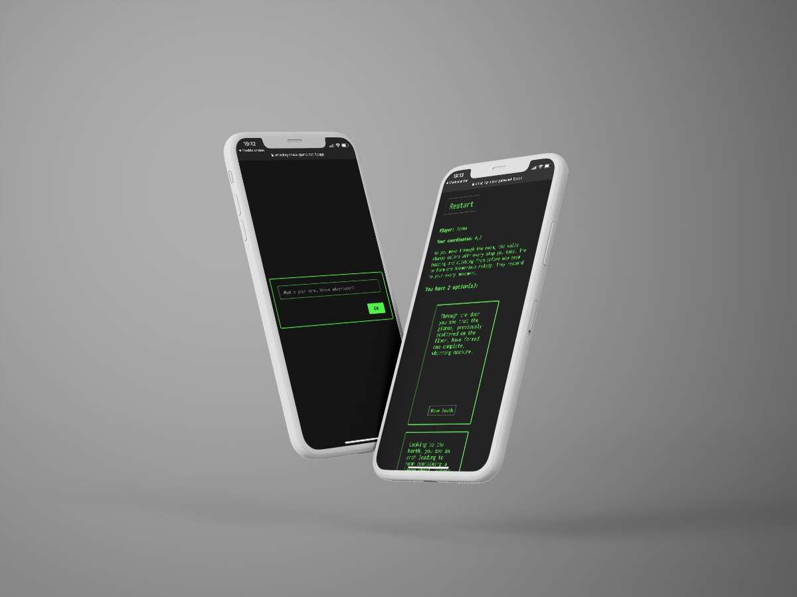

# Project Labyrinth&ensp;|&ensp;[View Live &#10132;](https://amazing-maze-game.netlify.app/)

A text-based adventure created using pair-programming with React Redux, Redux Toolkit, thunks and reusable components. The game state is persisted using local storage. Storing the players history in state, resets when restarting the game. An animated loader using keyframes styled with styled components.

## Core Tech

- React
- React Redux
- Redux Thunk
- Redux Toolkit
- Styled Components
- Pair-programming

## View it live

https://amazing-maze-game.netlify.app/
